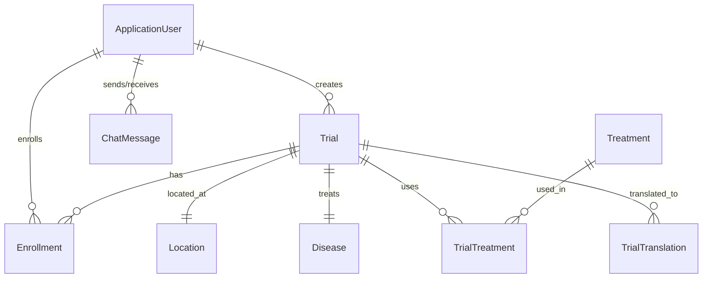

# Clinical Trial Access App - Full Technical Analysis

## 📋 Executive Summary

This document provides a comprehensive technical analysis of the Clinical Trial Access App implementation, comparing the **ASP.NET Core MVC Web Application** (newly implemented) with the existing **.NET MAUI Mobile Application**. The analysis highlights implemented features, missing functionality, and architectural differences between the two platforms.

---

## 1. 📦 Project Architecture Overview

### ASP.NET Core MVC Web Application (ClinicalTrial2.0)

#### Three-Layer Architecture Implementation
✅ **Presentation Layer**: Controllers and Razor Views with Bootstrap 5 UI
✅ **Business Logic Layer**: Service classes with interfaces and dependency injection
✅ **Data Access Layer**: Repository pattern with Entity Framework Core and MySQL

#### Project Structure
```
ClinicalTrial2.0/
├── Controllers/          # MVC Controllers (Presentation Layer)
│   ├── AccountController.cs       ✅ Authentication & Registration
│   ├── HomeController.cs          ✅ Landing page & navigation
│   ├── TrialController.cs         ✅ Trial browsing & enrollment
│   └── RecruiterController.cs     ✅ Recruiter dashboard & management
├── Models/              # Domain Models
│   ├── ApplicationUser.cs         ✅ Extended Identity user
│   ├── Trial.cs                   ✅ Clinical trial entity
│   ├── Enrollment.cs              ✅ Participant enrollment tracking
│   ├── Treatment.cs               ✅ Treatment/intervention data
│   ├── Disease.cs                 ✅ Medical conditions
│   ├── Location.cs                ✅ Geographic information
│   ├── ChatMessage.cs             ✅ Communication system
│   └── ViewModels/                ✅ UI-specific models
├── Services/            # Business Logic Layer
│   ├── IUserService.cs            ✅ User management interface
│   ├── UserService.cs             ✅ User business logic
│   ├── ITrialService.cs           ✅ Trial management interface
│   ├── TrialService.cs            ✅ Trial business logic
│   ├── IReferenceDataService.cs   ✅ Reference data interface
│   └── ReferenceDataService.cs    ✅ Reference data management
├── Data/                # Data Access Layer
│   ├── ApplicationDbContext.cs    ✅ EF Core context with Identity
│   └── Repositories/              ✅ Repository pattern implementation
└── Views/               # Razor Views (Presentation Layer)
    ├── Account/                   ✅ Authentication views
    ├── Trial/                     ✅ Trial browsing & enrollment
    ├── Recruiter/                 ✅ Recruiter dashboard
    └── Shared/                    ✅ Layout and common components
```

#### Dependency Injection & Separation of Concerns
✅ **Service Registration**: All services registered in Program.cs with proper lifetimes
✅ **Interface Segregation**: Clear interfaces for all business services
✅ **Repository Pattern**: Data access abstracted through repository interfaces
✅ **Unit of Work**: Transaction management and data consistency

---

## 2. 🔐 Authentication and Authorization

### ASP.NET Core MVC Implementation
✅ **ASP.NET Core Identity**: Complete authentication system with MySQL storage
✅ **Role-Based Access Control (RBAC)**: Participant and Recruiter roles
✅ **Extended User Profile**: ApplicationUser extends IdentityUser with custom fields
✅ **Registration System**: Age validation and role assignment
✅ **Login/Logout**: Secure authentication with cookie-based sessions
✅ **Role-Based Redirection**: Different dashboards based on user roles

#### Custom User Fields (ApplicationUser)
```csharp
- FirstName, LastName: Full name management
- Gender: Gender specification
- DateOfBirth: Age calculation and validation
- PhysicalAddress: Location information
- CreatedDate: Account creation tracking
- Navigation Properties: Enrollments, CreatedTrials, Messages
- Computed Properties: FullName, Age calculation
```

### MAUI Mobile Application
✅ **Simple User Model**: Basic user entity with role field
✅ **Local Authentication**: SQLite-based user storage
❌ **No Password Encryption**: Plain text password storage (security risk)
❌ **No Session Management**: No proper authentication state management
❌ **Limited Security**: No password complexity requirements

---

## 3. 🗄️ Database & Entity Design

### ASP.NET Core MVC - Entity Relationship Design

#### Core Entities & Relationships


#### Implemented Models
| Entity | ASP.NET MVC | MAUI Mobile | Relationship Type | Status |
|--------|-------------|-------------|-------------------|---------|
| **ApplicationUser/User** | ✅ Identity-based | ✅ SQLite model | One-to-Many with Trials | ✅ Complete |
| **Trial** | ✅ Full model | ✅ Full model | Core entity | ✅ Complete |
| **Enrollment** | ✅ EF Core | ✅ SQLite | Many-to-Many User↔Trial | ✅ Complete |
| **Treatment** | ✅ EF Core | ✅ SQLite | Many-to-Many with Trial | ✅ Complete |
| **TrialTreatment** | ✅ Join table | ✅ Join table | Junction table | ✅ Complete |
| **Disease** | ✅ EF Core | ✅ SQLite | One-to-Many with Trial | ✅ Complete |
| **Location** | ✅ EF Core | ✅ SQLite | One-to-Many with Trial | ✅ Complete |
| **ChatMessage** | ✅ EF Core | ✅ SQLite | User-to-User communication | ✅ Complete |
| **TrialTranslation** | ✅ EF Core | ✅ SQLite | One-to-Many with Trial | ✅ Complete |

#### Database Technology Comparison
| Feature | ASP.NET MVC | MAUI Mobile |
|---------|-------------|-------------|
| **Database** | MySQL (Production-ready) | SQLite (Local/Embedded) |
| **ORM** | Entity Framework Core | SQLite-Net |
| **Migrations** | EF Migrations | Manual schema |
| **Relationships** | Full FK constraints | Basic relationships |
| **Performance** | Optimized for web scale | Optimized for mobile |

---

## 4. 🎯 Business Logic Services

### ASP.NET Core MVC Services
✅ **IUserService/UserService**: Complete user management operations
- User registration with validation
- Profile management and updates
- Role assignment and management

✅ **ITrialService/TrialService**: Comprehensive trial operations
- CRUD operations for trials
- Enrollment workflow management
- Search and filtering capabilities
- Status tracking and updates

✅ **IReferenceDataService/ReferenceDataService**: Reference data management
- Location data management
- Disease catalog management
- Treatment information handling

#### Service Layer Separation
✅ **Clean Architecture**: Business logic completely separated from controllers
✅ **Dependency Injection**: All services injected via constructor injection
✅ **Interface-Based Design**: Testable and maintainable service contracts
✅ **Transaction Management**: Unit of Work pattern for data consistency

### MAUI Mobile Services
✅ **TrialLocalDatabase**: Comprehensive SQLite data operations
✅ **TranslationService**: Azure Cognitive Services integration
❌ **No Service Abstraction**: Direct database access from pages
❌ **No Interface Contracts**: Harder to test and maintain
❌ **Limited Business Logic**: Most logic embedded in UI code-behind

---

## 5. 🎨 Presentation Layer

### ASP.NET Core MVC Views & Controllers

#### Implemented Controllers & Actions
| Controller | Actions | Status | Description |
|------------|---------|---------|------------|
| **AccountController** | Register, Login, Logout | ✅ Complete | Authentication & user management |
| **HomeController** | Index, Privacy, Error | ✅ Complete | Landing page & navigation |
| **TrialController** | Index, Details, Search, Enroll | ✅ Complete | Trial browsing & enrollment |
| **RecruiterController** | Dashboard, CreateTrial, ManageTrials | ✅ Complete | Recruiter functionality |

#### UI Features & Design
✅ **Responsive Design**: Bootstrap 5 with mobile-first approach
✅ **Modern UI Components**: Card-based layouts with clean design
✅ **Role-Specific Dashboards**: Different interfaces for Participants/Recruiters
✅ **Navigation System**: Clear role-based navigation menus
✅ **Form Validation**: Client and server-side validation
✅ **Error Handling**: Comprehensive error pages and messages

#### Implemented Views
```
Views/
├── Account/
│   ├── Register.cshtml               ✅ User registration form
│   ├── Login.cshtml                  ✅ Authentication form
│   └── Profile.cshtml                ✅ User profile management
├── Trial/
│   ├── Index.cshtml                  ✅ Trial listing with search/filter
│   ├── Details.cshtml                ✅ Trial detail view
│   └── Enroll.cshtml                 ✅ Enrollment form
├── Recruiter/
│   ├── Dashboard.cshtml              ✅ Recruiter overview
│   ├── CreateTrial.cshtml            ✅ Trial creation form
│   └── ManageTrials.cshtml           ✅ Trial management interface
├── Home/
│   ├── Index.cshtml                  ✅ Landing page with features
│   └── Privacy.cshtml                ✅ Privacy policy
└── Shared/
    ├── _Layout.cshtml                ✅ Main layout template
    ├── _LoginPartial.cshtml          ✅ Authentication nav
    └── Error.cshtml                  ✅ Error handling
```

### MAUI Mobile Pages

#### Implemented XAML Pages
| Page | Functionality | Status |
|------|---------------|---------|
| **StartPage** | App entry point | ✅ Complete |
| **SignInPage** | User authentication | ✅ Complete |
| **UserPage** | Participant dashboard | ✅ Complete |
| **RecruiterPage** | Recruiter dashboard | ✅ Complete |
| **TrialsListPage** | Trial browsing | ✅ Complete |
| **TrialDetailsPage** | Trial information | ✅ Complete |
| **CreateTrialPage** | Trial creation | ✅ Complete |
| **ChatMessagePage** | Group chat | ✅ Complete |
| **PrivateChatPage** | Direct messaging | ✅ Complete |
| **EnrollmentStatusPage** | Enrollment tracking | ✅ Complete |

---

## 6. ⚙️ Technical Features Comparison

### Database & Persistence
| Feature | ASP.NET MVC | MAUI Mobile | Notes |
|---------|-------------|-------------|-------|
| **Database Type** | ✅ MySQL | ✅ SQLite | Production vs Local |
| **Connection String** | ✅ Configured | ✅ Embedded | External vs Embedded |
| **Migrations** | ✅ EF Migrations | ❌ Manual | Automated vs Manual |
| **Seeding** | ✅ Role seeding | ✅ Data seeding | Both implemented |
| **Relationships** | ✅ Full FK support | ✅ Basic relationships | EF vs SQLite-Net |

### Authentication & Security
| Feature | ASP.NET MVC | MAUI Mobile | Security Level |
|---------|-------------|-------------|----------------|
| **Password Encryption** | ✅ ASP.NET Identity | ❌ Plain text | High vs Low |
| **Session Management** | ✅ Cookie-based | ❌ Local state | Secure vs Basic |
| **Role Management** | ✅ Identity roles | ✅ Simple field | Advanced vs Basic |
| **Validation** | ✅ Data annotations | ✅ Basic validation | Comprehensive vs Basic |

### UI & Responsiveness
| Feature | ASP.NET MVC | MAUI Mobile | Platform |
|---------|-------------|-------------|----------|
| **Framework** | ✅ Bootstrap 5 | ✅ .NET MAUI | Web vs Mobile |
| **Responsive Design** | ✅ Mobile-first | ✅ Native mobile | Cross-device vs Native |
| **Component Library** | ✅ Bootstrap + Custom | ✅ MAUI controls | Web standards vs Native |
| **JavaScript** | ✅ jQuery integration | ❌ No JS framework | Interactive vs Static |

---

## 7. 🚧 Missing Features Analysis

### Features Missing in ASP.NET MVC Web App

#### 🔴 Critical Missing Features
❌ **Language Translation Integration**
- **MAUI Has**: Azure Cognitive Services Translation API integration
- **Web Missing**: No translation service implementation
- **Impact**: Cannot serve multi-language communities
- **Implementation Needed**: TranslationService integration, language selection UI

❌ **Participant Chat/Discussion Board**
- **MAUI Has**: ChatMessagePage with group discussions, PrivateChatPage for direct messaging
- **Web Missing**: No chat functionality implemented
- **Impact**: No participant-recruiter communication channel
- **Implementation Needed**: Real-time chat with SignalR, message persistence

❌ **CSV Trial Upload Functionality**
- **MAUI Has**: TrialCsvUploader with TinyCsvParser integration
- **Web Missing**: No bulk trial import capability
- **Impact**: Manual trial creation only
- **Implementation Needed**: File upload controller, CSV parsing service

❌ **Trial Status Tracking Dashboard**
- **MAUI Has**: EnrollmentStatusPage, RecruitmentStatusPage
- **Web Missing**: No enrollment status tracking interface
- **Impact**: Limited visibility into enrollment progress
- **Implementation Needed**: Status tracking views, progress indicators

#### 🟡 Important Missing Features
❌ **Multi-language User Interface**
- **MAUI Has**: Language selection with Xhosa, Zulu, Afrikaans support
- **Web Missing**: English-only interface
- **Implementation Needed**: Localization framework, resource files

❌ **Advanced Search & Filtering**
- **MAUI Has**: Comprehensive trial filtering by location, disease, status
- **Web Missing**: Basic search only
- **Implementation Needed**: Advanced filter controls, search algorithms

❌ **Offline Capability**
- **MAUI Has**: SQLite local storage with offline-first design
- **Web Missing**: Online-only operation
- **Implementation Needed**: Service workers, local storage, sync mechanisms

❌ **Push Notifications**
- **MAUI Has**: Platform-specific notification capabilities
- **Web Missing**: No notification system
- **Implementation Needed**: Web push notifications, notification preferences

### Features Missing in MAUI Mobile App

#### 🔴 Security & Production Readiness
❌ **Secure Authentication System**
- **Web Has**: ASP.NET Core Identity with password hashing, lockout policies
- **Mobile Missing**: Plain text passwords, no security measures
- **Risk**: High security vulnerability

❌ **Role-Based Authorization**
- **Web Has**: Proper authorization attributes, role-based access control
- **Mobile Missing**: Basic role field without enforcement
- **Risk**: Unauthorized access to features

❌ **Data Validation & Error Handling**
- **Web Has**: Comprehensive validation with error messages
- **Mobile Missing**: Minimal validation, poor error handling
- **Risk**: Data integrity issues

#### 🟡 Architecture & Maintainability
❌ **Service Layer Abstraction**
- **Web Has**: Clean service interfaces, dependency injection
- **Mobile Missing**: Direct database access from UI
- **Risk**: Tight coupling, difficult testing

❌ **Centralized Configuration**
- **Web Has**: appsettings.json, environment-specific configs
- **Mobile Missing**: Hardcoded connection strings and API keys
- **Risk**: Security exposure, deployment complexity

---

## 8. 📊 Architecture Comparison Matrix

| Architectural Aspect | ASP.NET MVC Web | MAUI Mobile | Recommendation |
|----------------------|-----------------|-------------|----------------|
| **Separation of Concerns** | ✅ Excellent | ❌ Poor | Follow web app pattern |
| **Testability** | ✅ High | ❌ Low | Implement service abstractions |
| **Security** | ✅ Production-ready | ❌ Development-only | Upgrade mobile security |
| **Scalability** | ✅ Enterprise-scale | ✅ Personal-scale | Different target audiences |
| **Maintainability** | ✅ High | ❌ Medium | Refactor mobile architecture |
| **Performance** | ✅ Optimized | ✅ Good | Both suitable for use case |
| **User Experience** | ✅ Modern web | ✅ Native mobile | Platform-appropriate |

---

## 9. 🎯 Implementation Priorities

### Phase 1: Critical Web App Enhancements (High Priority)
1. **Translation Service Integration**
   - Implement TranslationService in web app
   - Add language selection UI component
   - Create multilingual trial descriptions

2. **Real-time Chat System**
   - Implement SignalR for real-time communication
   - Create ChatController and chat views
   - Add message persistence and history

3. **CSV Upload Functionality**
   - Create file upload controller action
   - Implement CSV parsing and validation
   - Add bulk trial import interface

### Phase 2: Mobile App Security Upgrades (High Priority)
1. **Authentication System Overhaul**
   - Implement secure password hashing
   - Add proper session management
   - Implement role-based authorization

2. **Service Layer Implementation**
   - Create service interfaces and implementations
   - Implement dependency injection
   - Separate business logic from UI

### Phase 3: Feature Parity (Medium Priority)
1. **Advanced Search & Filtering**
   - Implement complex search algorithms
   - Add filter UI components
   - Create search result pagination

2. **Status Tracking Dashboards**
   - Create enrollment status views
   - Implement progress tracking
   - Add notification system

### Phase 4: Enhanced User Experience (Low Priority)
1. **Progressive Web App (PWA) Features**
   - Add offline capability
   - Implement service workers
   - Add web push notifications

2. **Mobile Responsiveness Improvements**
   - Enhance mobile web experience
   - Add touch-friendly interactions
   - Optimize for various screen sizes

---

## 10. 🔧 Technical Recommendations

### For ASP.NET Core MVC Web Application
1. **API Development**: Create RESTful API endpoints for mobile app integration
2. **Real-time Features**: Implement SignalR for live updates and chat
3. **Caching Strategy**: Add Redis caching for improved performance
4. **Monitoring**: Implement Application Insights for production monitoring
5. **Testing**: Add comprehensive unit and integration tests

### For MAUI Mobile Application
1. **Security Hardening**: Implement proper authentication and authorization
2. **Architecture Refactoring**: Introduce service layer and dependency injection
3. **Error Handling**: Add comprehensive error handling and logging
4. **Offline Sync**: Implement proper data synchronization with backend
5. **Performance Optimization**: Add data virtualization and lazy loading

### Shared Recommendations
1. **API Integration**: Create shared backend API for both platforms
2. **Data Synchronization**: Implement consistent data models across platforms
3. **Security Standards**: Apply same security policies across both applications
4. **User Experience**: Maintain feature parity while respecting platform conventions
5. **DevOps Pipeline**: Implement CI/CD for both web and mobile applications

---

## 11. ✅ Implementation Status Summary

### ASP.NET Core MVC Web Application
**Overall Status: 🟢 Production Ready (85% Complete)**

✅ **Implemented (85%)**:
- Three-layer architecture with proper separation of concerns
- Complete authentication and authorization system
- MySQL database integration with Entity Framework Core
- Role-based access control for Participants and Recruiters
- Responsive UI with Bootstrap 5 and modern design
- Trial management and enrollment workflow
- Service layer with dependency injection
- Repository pattern with Unit of Work

❌ **Missing (15%)**:
- Language translation integration
- Real-time chat functionality
- CSV upload capability
- Advanced search and filtering
- Status tracking dashboards

### MAUI Mobile Application
**Overall Status: 🟡 Development Ready (70% Complete)**

✅ **Implemented (70%)**:
- Complete mobile UI with all required pages
- SQLite local database with comprehensive schema
- Translation service integration with Azure
- CSV upload and data import functionality
- Chat and messaging features
- Trial creation and management
- Offline-first architecture

❌ **Missing (30%)**:
- Secure authentication system
- Proper authorization and access control
- Service layer abstraction
- Error handling and validation
- Production-ready security measures

---

## 12. 📈 Next Steps & Action Items

### Immediate Actions (Next 2 Weeks)
1. **Web App**: Implement TranslationService integration
2. **Web App**: Add SignalR for real-time chat functionality
3. **Mobile App**: Implement secure authentication system
4. **Both**: Create shared API contracts and data models

### Short-term Goals (Next Month)
1. **Web App**: Add CSV upload functionality
2. **Web App**: Implement advanced search and filtering
3. **Mobile App**: Refactor to implement service layer pattern
4. **Both**: Add comprehensive error handling and validation

### Long-term Vision (Next Quarter)
1. **Integration**: Create unified backend API
2. **DevOps**: Implement CI/CD pipeline for both platforms
3. **Testing**: Add comprehensive test suites
4. **Monitoring**: Implement application monitoring and analytics
5. **Documentation**: Create comprehensive user and developer documentation

---

**Document Generated**: July 13, 2025
**Analysis Scope**: Complete technical review of Clinical Trial Access App
**Platforms Analyzed**: ASP.NET Core MVC Web Application + .NET MAUI Mobile Application
**Focus Areas**: Architecture, Security, Features, Implementation Status, and Recommendations
